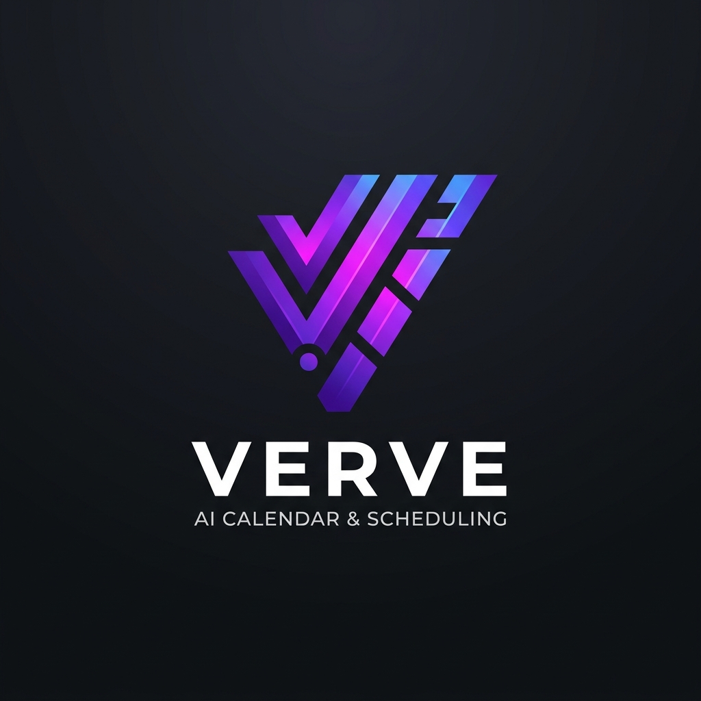

<div align="center">
  
  <h1>Verve</h1>
  <p><strong>The intelligent operating system for your professional time.</strong></p>
</div>

---

## 📖 Overview

Verve is an AI-native productivity platform that unifies task management, calendar scheduling, and workflow automation into a single, intelligent surface. Unlike passive to-do apps or traditional calendar tools, Verve understands your habits, goals, and constraints — and automatically builds, maintains, and defends your ideal day.

### 🛑 The Problem
Modern professionals suffer from massive cognitive overhead:
1. **Manual Scheduling:** When a meeting moves, cascading reschedules are completely manual.
2. **Disconnected Tools:** Task managers show *what* to do, but calendars show *when* to do it. The bridge between them is broken.
3. **Context Switching:** Bouncing between Notion, Google Calendar, Slack, and Gmail destroys deep focus.
4. **Generic AI:** Existing assistants lack knowledge of personal schedules, habits, and work styles.

### 🌟 The Vision
> *"Tell Verve what matters — it handles when it happens."*

Verve acts as your personal chief-of-staff: accepting new work via natural language, finding the optimal time to complete it, resolving conflicts, and adapting in real-time when plans change. Our goal is to reduce your scheduling time to zero.

---

## ✨ Key Features

### 🤖 AI-Powered Core
- **AI Task Parsing:** Type tasks in natural language (e.g., *"Review Q3 metrics tomorrow at 10am"*). Verve extracts dates, priorities, and categories automatically.
- **Auto-Rescheduling & Conflict Resolution:** When you miss a task or a conflict arises, Verve proposes the next best available slot within your week.
- **Conversational Assistant:** A dedicated AI agent that can plan multi-step sequences and execute them directly against your calendar.
- **Memory Layer:** Verve learns your work patterns and preferences over time to improve its suggestions.

### 🗂️ Unified Task & Calendar Management
- **Kanban & List Views:** Full drag-and-drop task boards with robust priority (Critical, High, Medium, Low) and category tagging.
- **Smart Calendar Overlays:** Unscheduled tasks sit in a sidebar, ready to be dragged onto your interactive calendar to secure a time block.
- **Google Calendar Sync:** Bidirectional sync ensures your external meetings never clash with your deep-work tasks.
- **Time-Locking:** Lock critical events so the AI never attempts to move them.

### ⚡ Speed & Efficiency
- **Keyboard-First Design:** Over 25+ keyboard shortcuts. You can manage your entire day without touching the mouse.
- **Omnibox Command Palette (`Alt+A`):** Instantly execute actions, navigate, or ask the AI to "defragment your afternoon."
- **Unified Inbox:** A centralized hub for all unprocessed tasks, AI suggestions, and external captures (via our Chrome Extension).

---

## 🏗️ Architecture & Tech Stack

Verve is built as a highly scalable, real-time monorepo:

- **Frontend:** Next.js 15, React 19, TypeScript, TailwindCSS, shadcn/ui
- **Backend:** Fastify, Node.js, TypeScript
- **Database:** PostgreSQL (via Supabase) with Drizzle ORM
- **Authentication:** Supabase Auth (Email + Google OAuth)
- **AI Integration:** OpenRouter API (Access to top-tier LLMs with automatic fallbacks)
- **Caching & Rate Limiting:** Upstash Redis
- **Extensions:** Google Chrome Extension (Manifest V3)

---

## 🚀 Getting Started (Local Development)

### Prerequisites
- Node.js >= 20.0.0
- pnpm >= 9.0.0
- Supabase account & project
- Upstash Redis account
- OpenRouter API Key

### 1. Environment Setup

Copy the environment templates in each app:
```bash
cp apps/backend/.env.example apps/backend/.env.local
cp apps/web/.env.example apps/web/.env.local
```

Fill in the required variables. **Never commit your `.env.local` files!**

**Backend (`apps/backend/.env.local`)**
- `SUPABASE_URL`: Your Supabase project URL
- `SUPABASE_SERVICE_ROLE_KEY`: Service role key (admin access)
- `OPENROUTER_API_KEY`: OpenRouter API key
- `UPSTASH_REDIS_REST_URL` & `TOKEN`: From your Upstash console

**Web (`apps/web/.env.local`)**
- `NEXT_PUBLIC_SUPABASE_URL`: Your Supabase URL
- `NEXT_PUBLIC_SUPABASE_ANON_KEY`: Anonymous key
- `NEXT_PUBLIC_API_URL`: Backend URL (usually `http://localhost:3001`)

### 2. Installation & Database

Install dependencies across the monorepo:
```bash
pnpm install
```

Push the database schema to your Supabase instance:
```bash
pnpm --filter=@verve/db db:push
```

### 3. Run the Application

Start the entire stack (Web + Backend) in parallel:
```bash
pnpm dev
```
- **Web App:** `http://localhost:3000`
- **Backend API:** `http://localhost:3001`

---

## 🛡️ Security & Privacy

- All user data is encrypted at rest (AES-256 via Supabase) and in transit (TLS 1.3).
- **Row Level Security (RLS)** is heavily utilized in PostgreSQL to ensure tenants cannot access each other's data.
- AI request limits (budgets) are strictly enforced server-side via transactional locks to prevent API abuse.

## 📄 License
Private and Confidential. All rights reserved.
